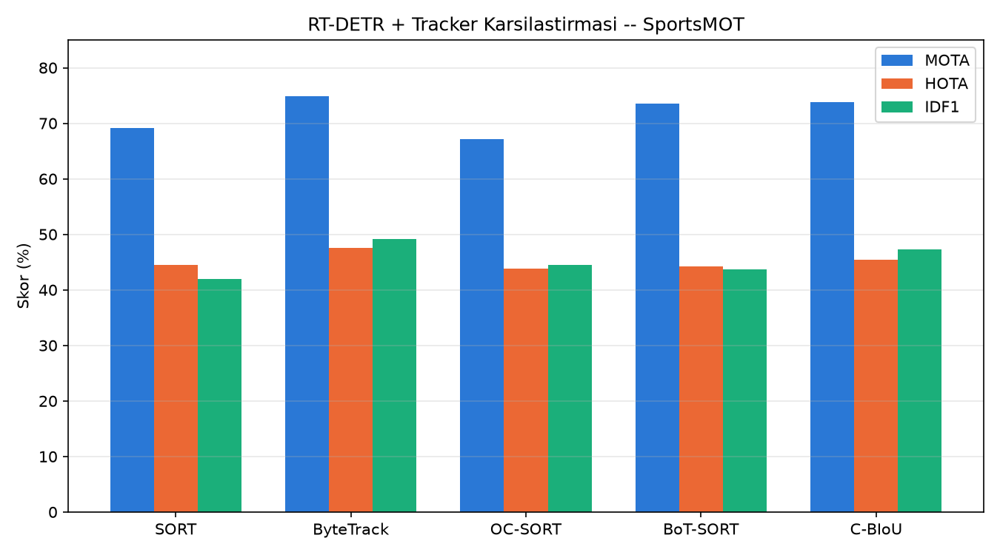

# RT-DETR + Trackers: SportsMOT Üzerinde Çoklu Nesne Takibi


Bu proje, [roboflow/trackers](https://github.com/roboflow/trackers) kütüphanesindeki
beş farklı takip (tracking) algoritmasının, pretrained **RT-DETR** dedektörüyle
birlikte **SportsMOT** veri seti üzerindeki performansını karşılaştırır.

## Bu proje ne yapıyor?

Bir spor videosunda (futbol/basketbol vb.) her oyuncuyu kare kare tespit edip,
video boyunca aynı oyuncuya **sabit bir kimlik (ID)** atayarak takip eder.
Sonuç: her oyuncunun kutusu üzerinde `#12`, `#47` gibi ID'ler ve arkasında
hareket izi (trace) bulunan bir çıktı videosu.

Kullanım alanları: spor analitiği (oyuncu hareket haritası, taktik analizi),
güvenlik kamerası takibi, trafik/araç sayımı gibi her "video üzerinde nesne
takibi" gerektiren senaryolar için temel bir referans mimari sunar.

## Mimari: Dedektör + Tracker ayrımı

Sistem iki bağımsız parçadan oluşur:

1. **Dedektör (RT-DETR)** — her karede "nesne nerede" sorusuna cevap verir,
   ama karadan kareye hafızası yoktur.
2. **Tracker** — dedektörün bulduğu kutuları kare kare birbirine bağlayıp
   kimlik atar ("3. karedeki kutu ile 4. karedeki kutu aynı oyuncu").

Bu ayrım sayesinde dedektör değiştirilebilir (RT-DETR yerine YOLO), tracker
değiştirilebilir (ByteTrack yerine BoT-SORT), ikisi birbirinden bağımsız çalışır.

### RT-DETR neden seçildi, YOLO'dan farkı ne?

| | YOLO | RT-DETR |
|---|---|---|
| Mimari | CNN + anchor kutuları (grid tabanlı) | CNN + transformer encoder-decoder |
| Son işleme | NMS (çakışan kutuları elemek) gerekir | Gerekmez — sabit sayıda öğrenilmiş sorgu (query) doğrudan tahmin üretir |
| Güçlü yanı | Hafif, çok hızlı, saha standardı | Global self-attention sayesinde örtüşen/yoğun sahnelerde daha güçlü ayrım |
| Bedeli | — | Biraz daha ağır, daha çok VRAM |

## Karşılaştırılan takip algoritmaları

- **SORT** — Kalman filtresi + IoU eşleştirmesine dayanan temel, hafif yöntem.
- **ByteTrack** — düşük güven skorlu tespitleri de değerlendirerek eşleştirme
  kalitesini artırır (kısmi tıkanmalarda ID kaybını azaltır).
- **OC-SORT** — gözlem merkezli düzeltmeyle hareket tahmin sapmalarını azaltan
  SORT varyantı.
- **BoT-SORT** — kamera hareketi kompanzasyonu (CMC) ve görünüm bilgisini
  birleştiren gelişmiş yöntem.
- **C-BIoU** — genişletilmiş IoU eşiğiyle hızlı hareket eden nesnelerde
  eşleştirmeyi güçlendiren yaklaşım.

## Veri seti

[SportsMOT](https://github.com/MCG-NJU/SportsMOT) — hızlı hareket, kamera
kaymaları ve birbirine görsel olarak çok benzeyen hedefler (aynı forma
renginde oyuncular) içeren, takip algoritmalarını zorlayan bir spor videosu
veri seti. Bu projede `val` bölümünden `v_00HRwkvvjtQ_c001` sekansı kullanıldı.

## Değerlendirme metrikleri

- **MOTA** (Multiple Object Tracking Accuracy) — kaçırılan tespit, yanlış
  pozitif ve kimlik değişimlerini birlikte cezalandıran genel doğruluk ölçütü.
- **HOTA** (Higher Order Tracking Accuracy) — tespit kalitesi ile kimlik
  ilişkilendirmesini dengeli biçimde birleştiren, günümüzde standart kabul
  edilen metrik.
- **IDF1** — bir hedefin takip boyunca aynı kimlikle izlenebilme başarısını
  ölçer; oyuncu kimliğinin korunması açısından özellikle önemlidir.

## Sonuçlar

| Tracker   | MOTA (%) | HOTA (%) | IDF1 (%) |
|-----------|---------:|---------:|---------:|
| SORT      | 69.17    | 44.55    | 41.90    |
| **ByteTrack** | **74.94** | **47.54** | **49.18** |
| OC-SORT   | 67.15    | 43.83    | 44.50    |
| BoT-SORT  | 73.52    | 44.17    | 43.73    |
| C-BIoU    | 73.87    | 45.44    | 47.27    |

Bu sekansta **ByteTrack** üç metrikte de en iyi sonucu verdi — özellikle
IDF1'deki üstünlüğü, oyuncu kimliklerinin sahne boyunca en az kesintiyle
korunduğunu gösteriyor.

## Karşılaştırma grafiği




## Kurulum

```bash
python -m venv venv
venv\Scripts\activate          # Windows
pip install -r requirements.txt
```

## Kullanım

**Veri setini indir:**
```bash
trackers download sportsmot --split val --asset frames,annotations -o data/sportsmot
```

**Tek tracker ile çalıştır:**
```bash
python src/run_tracking.py
```

**Tüm tracker'ları karşılaştır (video + tahmin dosyaları üretir):**
```bash
python src/compare_trackers.py
```

**Sonuçları değerlendir (HOTA/MOTA/IDF1):**
```bash
trackers eval --gt data/sportsmot/sportsmot/val/v_00HRwkvvjtQ_c001/gt/gt.txt \
  --tracker results/predictions/bytetrack/v_00HRwkvvjtQ_c001.txt \
  --metrics CLEAR HOTA Identity --columns MOTA HOTA IDF1
```

## Proje yapısı
src/
rtdetr_detector.py # RT-DETR -> sv.Detections sarmalayıcısı
run_tracking.py # Tek tracker ile hızlı deneme
compare_trackers.py # 5 tracker'ı sırayla çalıştırıp video+tahmin üretir
evaluate.py # trackers eval CLI sarmalayıcısı
download_data.py # SportsMOT indirme scripti


## Kullanılan araçlar

- [roboflow/trackers](https://github.com/roboflow/trackers)
- [RT-DETR](https://huggingface.co/PekingU/rtdetr_r50vd_coco_o365) (HuggingFace transformers)
- [supervision](https://github.com/roboflow/supervision)